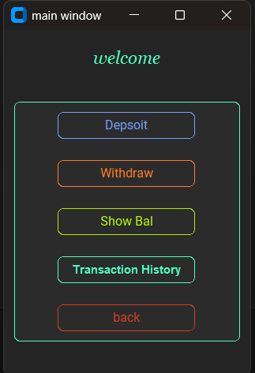
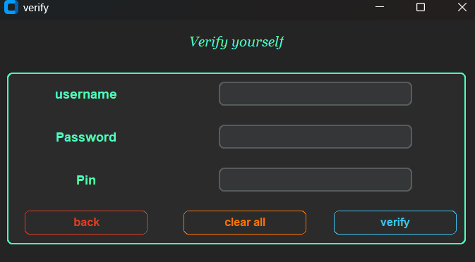
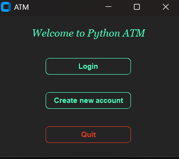
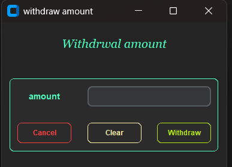

# 🏦 Python ATM GUI Application

A simple yet functional ATM simulator built using **Python**, **CustomTkinter**, and **MongoDB**, designed for multiple user handling, balance operations, and transaction history. This project offers a clean GUI interface to simulate ATM-like banking tasks.

---

## 📌 About the Project

This project is a basic desktop-based ATM system clone. It allows users to create accounts, securely log in, and perform banking operations like deposits, withdrawals, and balance checks. Every action is recorded in a transaction history that users can review anytime.

The GUI is designed using [CustomTkinter](https://github.com/TomSchimansky/CustomTkinter) for a modern and smooth experience, while MongoDB handles all data and transaction persistence.

---

## 🎯 Project Goal

- Practice Python GUI development using **CustomTkinter**
- Work with **MongoDB** for backend storage and document management
- Enhance knowledge in:
  - Event-driven programming
  - Database operations
  - Application logic and code structure
- Simulate a real-world use-case with login sessions, data validation, and secure inputs

---

## 🚀 Features

- ✅ Multiple account creation  
- ✅ Secure Login for Multiple Users  
- ✅ Deposit & Withdraw Money (with balance update)  
- ✅ Real-time Balance Display  
- ✅ Transaction History with Timestamp  
- ✅ Scrollable and Themed GUI using CustomTkinter  
- ✅ User verification for each task.

---
# Application preview
### Main window

---
### Verification window

---
### Welcome window

---
### withdrawl window

---

## 📁 Project Directory Structure

```
ATM/
├── atm_main.py          # Main Python script
├── README.md            # Project README file
└── screenshots          # UI Screenshots
```
---

## Modules / Libraries used
1. CustomTkinter 
2. pymongo
3. datetime
4. Tkinter
5. os
6. dotenv

---
## Requirements
- Python 3.8+
- CustomTkinter
- pymongo
- MongoDB (local or cloud)
- IDE 
- internet connection if using MongoDB cloud
